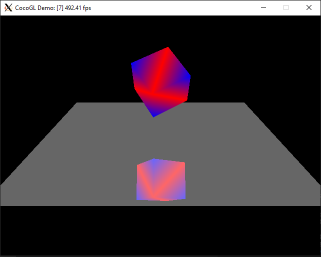

# CocoGL

CocoGL is an OpenGL ES 1.0/1.1 3D graphics software emulator for Windows and Linux.
The emulator accelerates 3D rasterization using template specialization.

This repository contains the complete implementation with a demo program testing various features of OpenGL ES.

The library documentation is available at:
https://gtcasl.github.io/cocogl/

Dependencies
------------
CocoGL requires C++17 compiler and above.

Other dependencies include:
  - [SDL 2.0] (https://www.libsdl.org/index.php)

Default Build Instructions (Ubuntu Trusty)
------------------------------------------

SDL 2.0 Install:

    sudo apt-get install libsdl2-dev

To use CocoGL you must clone the repository and build the sources

    git clone https://github.com/gtcasl/cocogl.git
    cd cocogl
    cd shared && make
    cd src/GLES_CM && make
    cd demo & make

Testing
    cd demo
    ./demo --help
    

